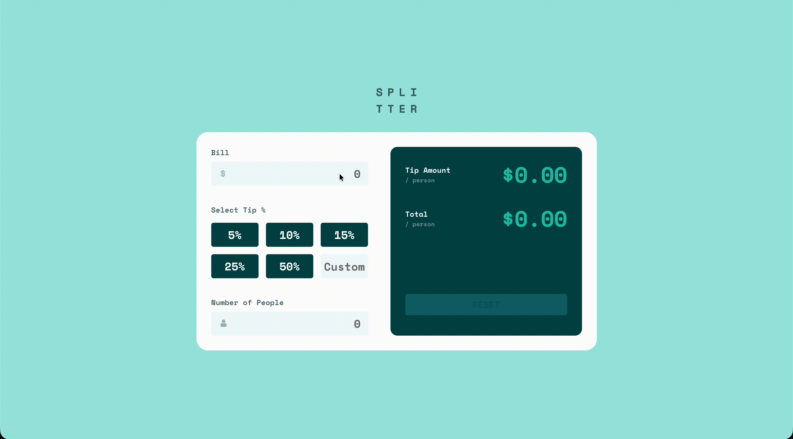
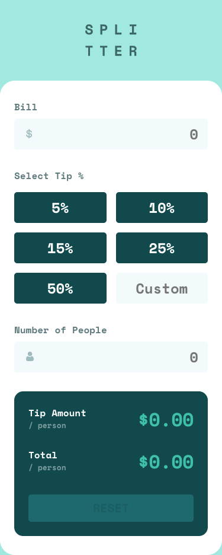
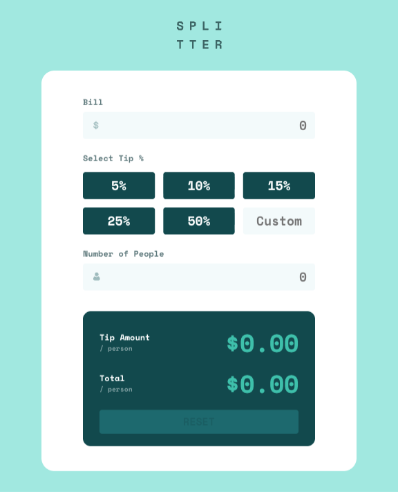
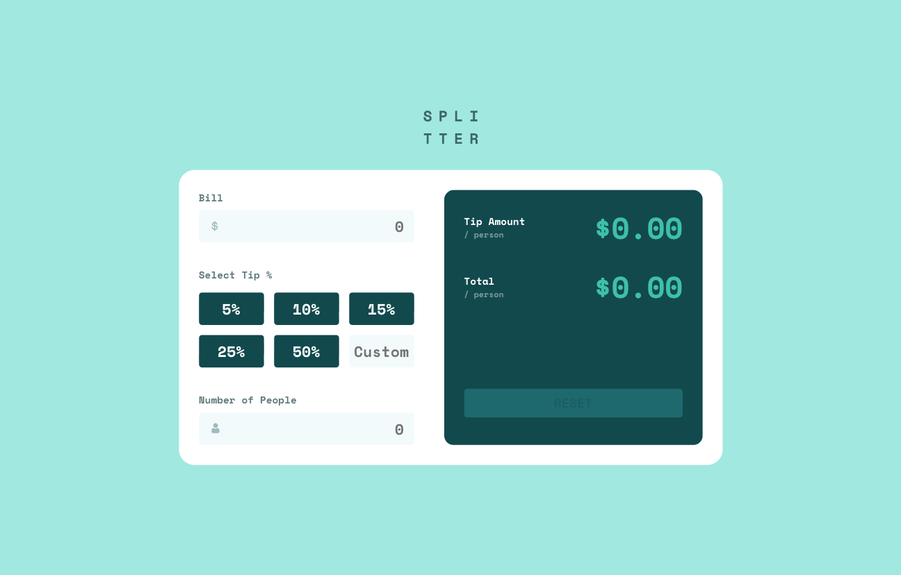
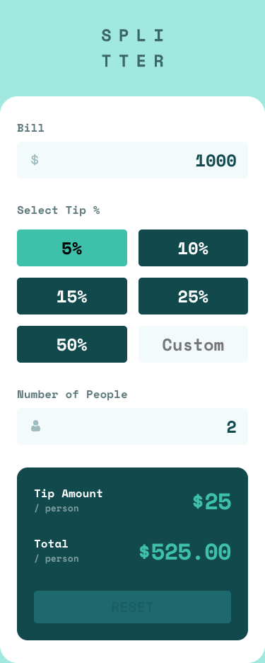
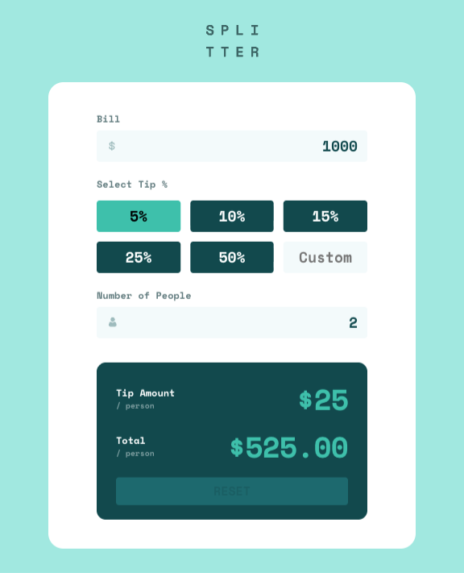
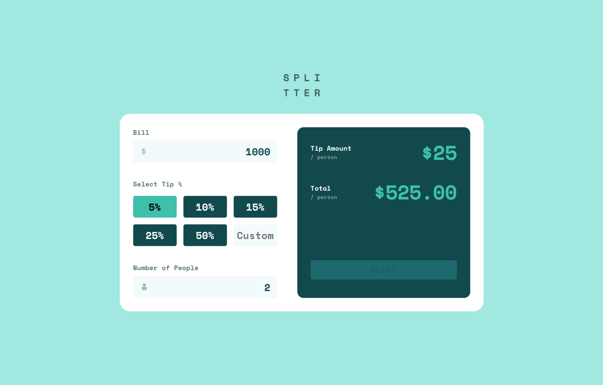
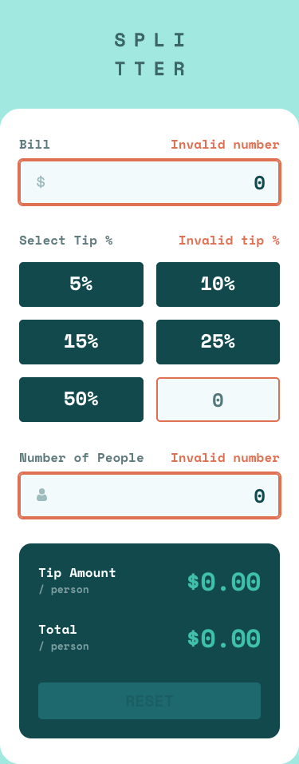
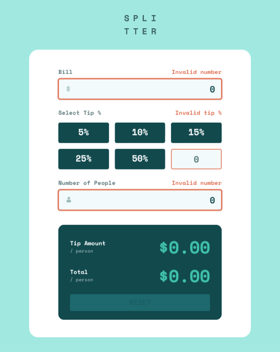

# 💸 Tip Calculator App

A responsive billing interface featuring dynamic tip calculations 🧮, preset and custom tip percentage inputs ⌨️, real-time bill splitting between multiple people 👥, and input validation with visual error feedback ✨.

## Overview

This project was developed as a high-fidelity implementation of a Figma design 🎨 focusing on creating a precise and interactive billing interface across mobile 📱, tablet 📲, and desktop 💻 environments.

Key focus areas included building a flexible CSS Flexbox and Grid architecture 🏗️ to manage the calculator's layout, implementing real-time input validation ⚠️ to handle edge cases (like zero-value, negative values inputs), and employing JavaScript DOM manipulation ⚡ to dynamically calculate and display tip amounts and totals as the user types 📄.

## 🔗 Live Demo

## 🎨 Visual Design

| State 🎛️       | Mobile 📱                                             | Tablet 📲                                             | Desktop 💻                                             |
| :------------- | :---------------------------------------------------- | :---------------------------------------------------- | :----------------------------------------------------- |
| **✨ Default** |  |  |  |
| **🔢 Active**  |   |   |   |
| **⚠️ Error**   |    |    |    |

## 🎯 The Challenge

The challenge was to build out this **tip calculator app 💸** and get it looking as close to the design as possible, ensuring all mathematical logic was accurate and responsive.

### 🧑‍💻 Users should be able to:

- 🧮 Calculate the **correct tip** and **total cost** of the bill per person dynamically.

- 📱 View the optimal layout for the app depending on their device's screen size.

- 🖱️ See hover and focus states for all interactive elements on the page.

- ⚠️ Receive visual feedback (error states) when entering invalid data.

## 🛠️ Built with

## 🚀 Features

- 🧮 **Real-Time Calculations:** Instantly computes tip amount and total cost per person as users input their bill, tip percentage, and number of people.

- 🎛️ **Flexible Tip Selection:** Offers preset tip percentages (5%, 10%, 15%, 25%, 50%) plus a custom input field for any desired amount.

- 🚫 **Input Validation:** Displays dynamic error messages for invalid entries, with visual feedback on input fields to guide the user.

- 📐 **Responsive Architecture:** Employs a mobile.first approach with media queries to create a fluid layout that adapts seamlessly to mobile, tablet, and desktop screens.

- ✨ **Polished User Experience:** Features smooth hover and focus states across all interactive elements, plus a reset button to clear all fields instantly.

## 👤 Author

**Christian Diaz**

- 💼 LinkedIn - [Christian Diaz](https://www.linkedin.com/in/chris-diazasc/)
- 👾 Frontend Mentor - [@chrisdzasc](https://www.frontendmentor.io/profile/chrisdzasc)
- 🧩 Frontend Mentor Solution - 
